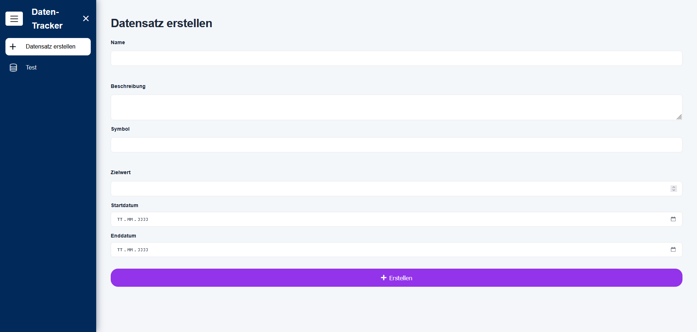
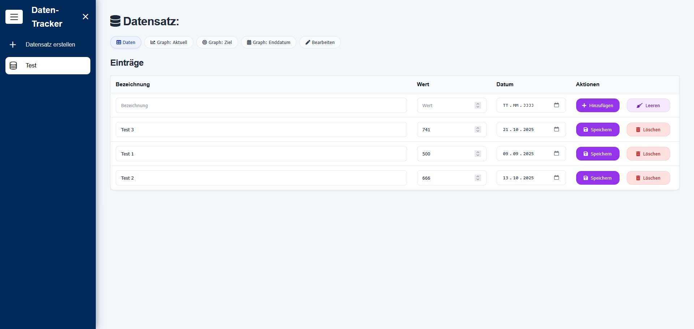
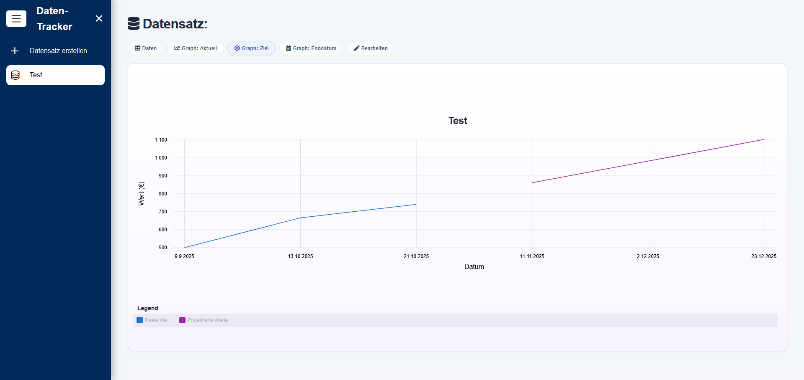

# dataTracker

**dataTracker** is a simple web-based tool for creating, managing, and visualizing datasets. Users can track values over time and visualize progress toward optional target goals.

---

## Features

- **Create Datasets**
    - Choose a symbol for your values (€, $, kW, etc.)
    - Optional target value
    - Optional start and end date

    

- **Manage Dataset Entries**
    - Add entries with a label, value, and date
    - Edit or delete existing entries

    

- **Visualize Data**
    - **Graph 1:** Shows the real data
    - **Graph 2:** Calculates when the target value will be reached (based on the average)
    - **Graph 3:** Projects what the value could be on the end date (based on the average)

    

- **Customizable Texts**
    - All UI texts are currently in German
    - Can be modified in `frontend/src/services/message-service.ts`

---

## Tech Stack

- **Backend:** Go
- **Frontend:** Angular
- **Database:** PostgreSQL
- **Deployment:** Docker & Docker Compose

---

## Getting Started

### Prerequisites

- Docker
- Docker Compose

### Setup

1. Clone the repository:

    ```bash
    git clone https://github.com/LukasTrust/dataTracker.git
    cd dataTracker

2. Edit the `.env` file and set the environment variables or leave them as they are.
3. Start the application using Docker Compose:

    ```bash
    docker-compose up --build

## Notes

- The backend automatically connects to PostgreSQL based on .env settings.
- The frontend allows switching the UI texts in message-service.ts.
- Currently, the UI is in German, but it can be fully localized.

## License

MIT License